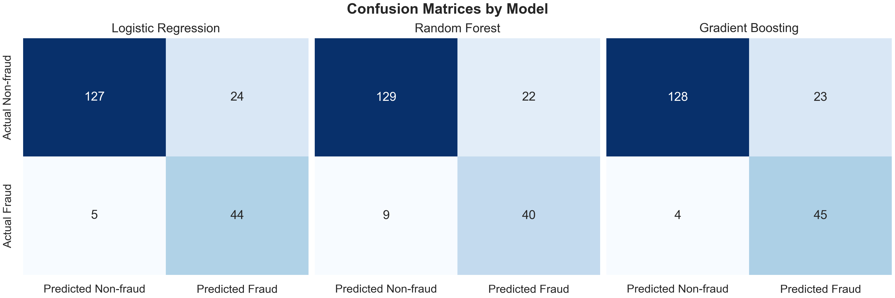
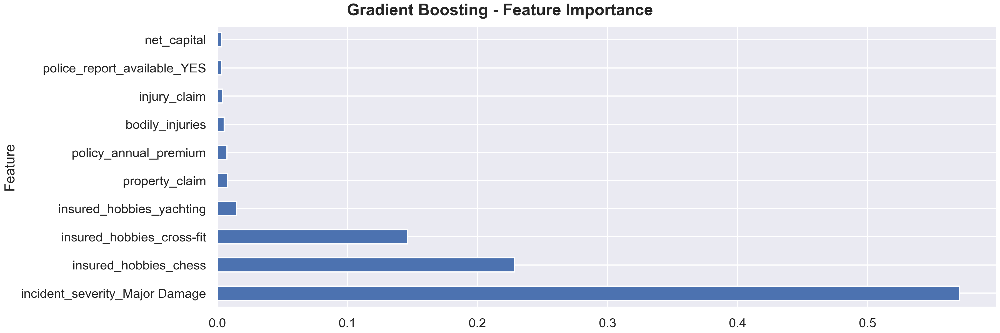
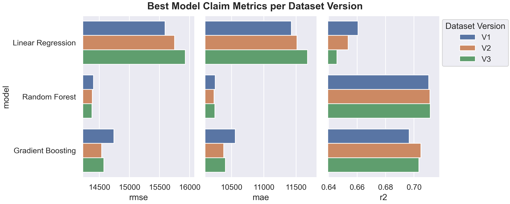
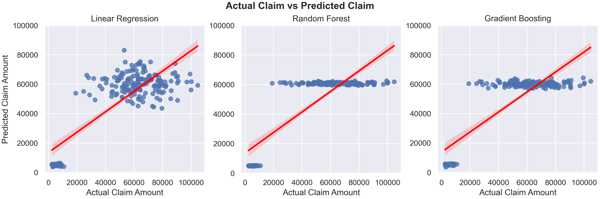
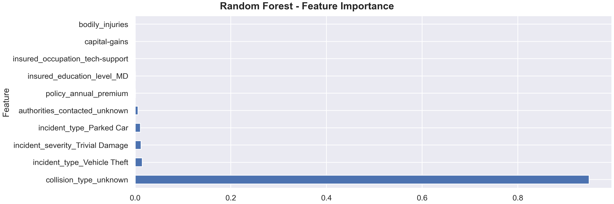

# Insurance Fraud Detection & Claims Prediction

## Contents

- [Overview](#Overview)
    - [Repository Structure](#Repository-Structure)
    - [Dataset](#Dataset)
- [Data Cleaning](#Data-Cleaning)
- [Insurance Fraud Classification](#Insurance-Fraud-Classification)
    - [Exploratory Data Analysis](#Exploratory-Data-Analysis)
    - [Feature Engineering](#Feature-Engineering)
    - [Modelling](#Modelling)
    - [Evaluation](#Evaluation)
    - [Conclusion](#Conclusion)
- [Insurance Claim Cost Prediction](#Insurance-Claim-Cost-Prediction)
    - [Exploratory Data Analysis](#Exploratory-Data-Analysis)
    - [Feature Engineering](#Feature-Engineering)
    - [Modelling](#Modelling)
    - [Evaluation](#Evaluation)
    - [Conclusion](#Conclusion)
- [Environment Setup](#Environment-Setup)

## Overview

This project investigates insurance claim fraud detection and claim cost prediction using machine learning. It is split up into two sections: 

1. [Insurance Fraud Classification](#Insurance-Fraud-Classification) - predicting whether a claim is fraudulent.
2. [Insurance Claim Cost Prediction](#Insurance-Claim-Cost-Prediction) - estimating the total claim amount.

The project includes exploratory data analysis, feature engineering, model development, and model evaluation for both tasks. 

### Repository Structure

The project contains notebooks, utility functions, and generated figures. The following files are not included:
- Original and processed datasets
- Trained models
- Model outputs and metrics for evaluation

```text
data/               # Dataset files (not included)
figures/            # Generated plots
notebooks/          # EDA, feature engineering, modelling and analysis notebooks
notes/              # Model metrics during training
utils/              # Helper, modelling, and plotting functions
.gitignore
README.md
environment.yml     # Environment dependencies
```

### Dataset

The dataset consists of 1,000 insurance claims records with 40 features spanning numeric, categorical, and datatime data types. The data is not included in this repository, and can be downloaded from [Kaggle](https://www.kaggle.com/datasets/buntyshah/auto-insurance-claims-data).

The features describe the insurance policy, incidents, vehicles, and claim information. The classification target, `fraud_reported`, is a binary variable indicating whether a claim was fraudulent. The regression target, `total_claim_amount`, represents the total value of a claim. 

## Data Cleaning

Before any analysis and modelling took place, the quality of the data was assessed. The dataset was generally ready to use, only requiring a small number of corrections and adjustments. 

- Removed an unnamed column containing only missing values.
- Corrected a single negative value in `umbrella_limit`. This was likely a data entry error, as there are no other similar mistakes in the dataset. 
- Adjusted `?` values in three different features. These values appeared to be unknown information rather than true missing data, so they were renamed and treated as valid categories.

## Insurance Fraud Classification

### Exploratory Data Analysis

An EDA was performed to investigate the relationship between the features and fraud. This included:

- Distribution analysis of numeric features.
- Correlation analysis between numeric features, including fraud.
- Comparison of categorical feature frequency across fraud classes.
- Statistical testing using t-tests and chi-square.
- Analysis between fraud classes over months and days.

The key findings include significant differences in claim-related features between fraud and non-fraud cases, as well as a strong association between fraud and several categorical features, particularly `incident_severity` and `insured_hobbies`. 

Figures can be found in `figures/fraud/eda`.

### Feature Engineering

Three dataset versions were created and compared.

- V1: Baseline cleaned dataset removing ID, high cardinality, and highly correlated features. Separated datetime features into month and day features.
- V2: Used the V1 dataset with the addition of `policy_duration` derived from `indicent_date` and `policy_bind_date`.
- V3: Used the V2 dataset with the addition of `net_capital` derived from `capital-gains` and `capital-loss`. 

Each new feature was analysed against the fraud classes. Figures can be found in `figures/feature_engineering/eda`.

### Modelling

The following classification models were trained:

- Logistic Regression
- Random Forest
- Gradient Boosting

The models were trained using an 80:20 train-test split with hyperparameter tuning and threshold optimisation where needed.

### Evaluation

Each model was evaluated using:

- Precision
- Recall
- F1-score
- Confusion Matrices
- ROC curves and AUC

As the objective here was fraud detection, recall was prioritised to minimise missed fraudulent claims. Accuracy was not assessed due to being a misleading metric for the task. 


- Logistic regression improved after the introduction of `policy_duration`, but declined with `net_capital`.
- Random forests' performance decreased with each new dataset version.
- Gradient boosting metrics remained the same through each version.



- Gradient boosting performed the best overall for fraud detection, achieving the highest number of correctly identified fraud cases while maintaining a low false positive rate.
- Random forest identified the most non-fraud incidents, but misses the most true fraud cases.
- Logistic regression provides similar results to gradient boosting, but has slightly lower fraud recall and a higher false positive rate. 



- `incident_severity_Major Damage` was the most influential predictor, contributing more than half of the gradient boosting's total feature importance.
- `insured_hobbies` indicates that certain customer characteristics, particularly chess and cross-fit, play an important role in gradient boosting predictions.
-  The engineered features, `net_capital`, were among the 10 most important predictors of fraud for gradient boosting.

The rest of the figures can be found at `figures/fraud/evaluation`.

### Conclusion

- Gradient boosting achieved the strongest overall fraud detection performance, balancing high recall with good precision.
- As the dataset is small, some important features like `insured_hobbies` are likely dataset-specific and will not generalise to unseen data.
- The most influential predictor, `incident_severity_Major Damage`, is directly connected with fraud risk, suggesting the model maps capture patterns that are likely to be generalisable.

## Insurance Claim Cost Prediction

### Exploratory Data Analysis

An EDA was performed to investigate the relationship between the features and the `total_claim_amount`. This included:

- Relationship between numeric features and the target feature.
- Correlation analysis between numeric features.
- Distribution of categorical feature values.
- Temporal and distribution analysis of `total_claim_amount` across months and days.

The key findings include a bimodal distribution in `total_claim_amount` betweenm high and low claims, differences in claim amounts across several categorical feature values, and a weak positive relationship between `number_of_vehicles_involved`, `incident_hour_of_the_day`, and the target feature. 

Figures can be found in `figures/claims/eda`.

### Feature Engineering

Three dataset versions were created and compared.

- V1: Baseline cleaned dataset removing ID, high cardinality, and highly correlated features. Split the datetime features into a day feature.
- V2: Used the V1 dataset with the addition of `vehicle_class`, which maps `auto_model` to a vehicle type such as `SUV` or `sedan`.
- V3: Used the V1 dataset with the addition of `incident_time_period`, which maps `incident_hour_of_the_day` to classes such as `morning` or `night`.

Each new feature was analysed against the `total_claim_amount`. Figures can be found in `figures/clams/feature_engineering`.

### Modelling

The following regression models were trained:

- Linear Regression
- Random Forest
- Gradient Boosting

The models were trained using an 80:20 train-test split with hyperparameter tuning for random forest and gradient boosting.

### Evaluation

Each model was evaluated using:

- Root mean square error (RMSE)
- Mean absolute error (MAE)
- $R^{2}$



- Linear regression performance declined with each new dataset verison, with higher RMSE and MAE and a lower $R^{2}$.
- Random forest perforamnce improved across dataset versions, with lower RMSE and higher $R^{2}$ values. However, MAE increased with the additon of `incident_time_period`.
- Gradient boosting showed large imporvement with the addition of `vehicle_class`, but got worse with `incident_time_period`.



- All three models identified two distinct claim groups, with predictions clustering around the lower and higher claim classes, which reflects the bimodal distribution of the data.
- Linear regression produces the widest spread of predictions for both claim groups, suggesting more variability in predictions.
- Random forest produces very dense predictions around 5,000 and 60,000, which are close to the means of each claim class.
- Gradient boosting performance is between the other models, prodictions more dense predicitons than linear forest but with more variation than random forest. 



- Random forest model heavily relies on a single feature `collision_type_unknown` for its predictions.
- The remaining predictions are distributed among four features, three of which are `incident_type` values.
- The model appears to first distinguish between the claim classes before making small adjustments to predictions using other features. This behaviour is consistent with a prediction scatter plot.

The rest of the figures can be found at `figures/claims/evaluation`.

### Conclusion

- Overall, all models struggled to accuratley predict the `total_claim_amount`, with predictions regressing to the mean as metrics became better.
- An approach utilising three models would be the next step: create a classifier to distinguish between high and low claims, and then use two separate regression models to predict the claim amount within each class.
- There are problems with the proposed approach, particularly the class imbalance and the size of the dataset, which limits the total training data available for all models. 

## Environment Setup

Create the environment: `conda env create -f environment.yml`
Activate: `conda activate auto_insurance_ml`


