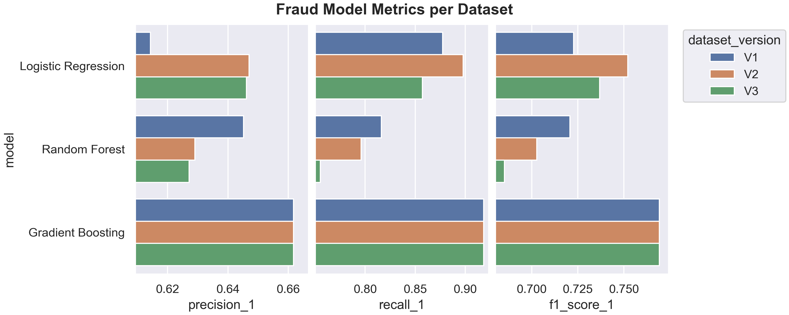

# Insurance Fraud Detection & Claims Prediction

## Overview

This project investigates insurance claim fraud detection and claim cost prediction using machine learning. It is split up into two sections: 

1. [Insurance Fraud Classification](#Insurance-Fraud-Classification) - predicting whether a claim is fraudulent.
2. [Insurance Claim Cost Prediction](#Insurance-Claim-Cost-Prediction) - estimating the total claim amount.

The project includes exploratory data analysis, feature engineering, model development, and model evaluation for both tasks. 

### Repository Structure

The project contains notebooks, utility functions, and generated figures. The following files are not included:
- Original and processed datasets
- Trained models
- Model outputs and metrics for evaluation

```text
data/               # Dataset files (not included)
figures/            # Generated plots
notebooks/          # EDA, feature engineering, modelling and analysis notebooks
notes/              # Model metrics during training
utils/              # Helper, modelling, and plotting functions
.gitignore
README.md
environment.yml     # Environment dependencies
```

### Dataset

The dataset consists of 1,000 insurance claims records with 40 features spanning numeric, categorical, and datatime data types. The data is not included in this repository, and can be downloaded from [Kaggle](https://www.kaggle.com/datasets/buntyshah/auto-insurance-claims-data).

The features describe the insurance policy, incidents, vehicles, and claim information. The classification target, `fraud_reported`, is a binary variable indicating whether a claim was fraudulent. The regression target, `total_claim_amount`, represents the total value of a claim. 

## Data Cleaning

Before any analysis and modelling took place, the quality of the data was assessed. The dataset was generally ready to use, only requiring a small number of corrections and adjustments. 

- Removed an unnamed column containing only missing values.
- Corrected a single negative value in `umbrella_limit`. This was likely a data entry error, as there are no other similar mistakes in the dataset. 
- Adjusted `?` values in three different features. These values appeared to be unknown information rather than true missing data, so they were renamed and treated as valid categories.

## Insurance Fraud Classification

### Exploratory Data Analysis
An EDA was performed to investigate the relationship between the features and fraud. This included:

- Distribution analysis of numeric features.
- Correlation analysis between numeric features, including fraud.
- Comparison of categorical feature frequency across fraud classes.
- Statistical testing using t-tests and chi-square.
- Analysis between fraud classes over months and days.

Figures can be found in ```text figures/fraud/eda```

### Feature Engineering
Three dataset versions were created and compared.

- V1: Baseline cleaned dataset removing ID, high cardinality, and highly correlated features. Separated datetime features into month and day features.
- V2: Used the V1 dataset with the addition of `policy_duration` derived from `indicent_date` and `policy_bind_date`.
- V3: Used the V2 dataset with the addition of `net_capital` derived from `capital-gains` and `capital-loss`. 

Each new feature was briefly analysed against the fraud classes. Figures can be found in ```text figures/feature_engineering/eda```

### Modelling
The following classification models were trained:

- Logistic Regression
- Random Forest
- Gradient Boosting

The models were trained using an 80:20 train-test split with hyperparameter tuning and threshold optimisation where needed.

### Evaluation
Each model was evaluated using:

- Precision
- Recall
- F1-score
- Confusion Matrices
- ROC curves and AUC

As the objective here was fraud detection, recall was prioritised to minimise missed fraudulent claims. Accuracy was not assessed due to being a misleading metric for the task. 



## Insurance Claim Cost Prediction


### Exploratory Data Analysis


### Feature Engineering


### Modelling


### Evaluation


